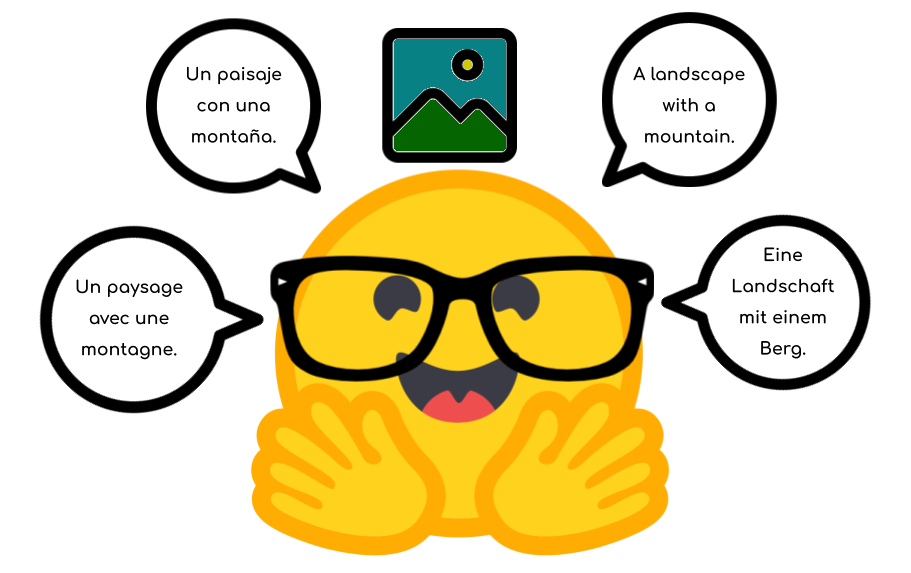
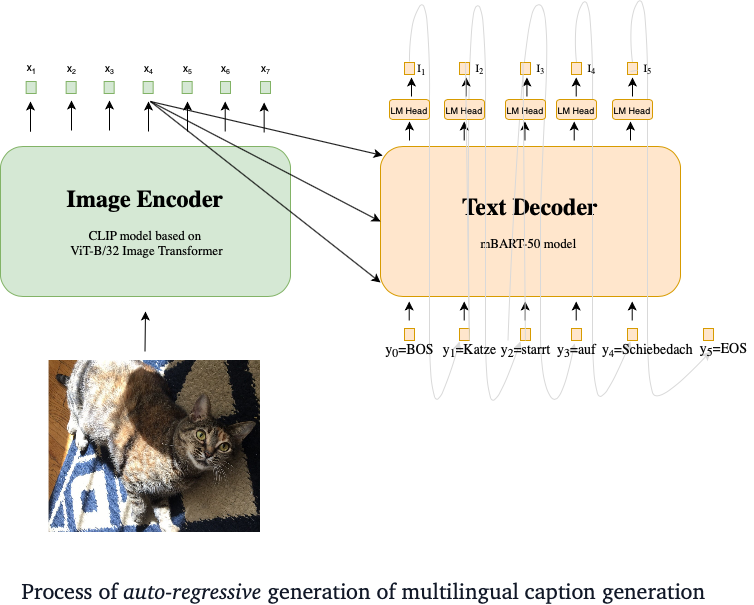

<p align="center">

</p>

# Multilingual Image Captioning 

Authors: **Bhavitvya Malik**, **Gunjan Chhablani**
</br>
Demo Link: https://huggingface.co/spaces/flax-community/multilingual-image-captioning

GitHub Repository for Multilingual Image Captioning task created during HuggingFace JAX/Flax community week. Multilingual Image Captioning addresses the challenge of caption generation for an image in a multilingual setting. Here, we fuse CLIP Vision transformer into mBART50 and perform training on translated version of Conceptual-12M dataset.

- Our models are present in the `models` directory. We have combined CLIP Vision+mBART-50 in the model repository.
- Our training scripts are:
  - `run.sh` for pre-training.

## Usage:
- Install the `requirements.txt` file in your environment.
- To run a training script, just use your command line:
```sh
./run.sh
```
- Inference (You will need to clone the model from here as well):
```python
from torchvision.io import read_image
import numpy as  np
import os, wget
from transformers import CLIPProcessor, MBart50TokenizerFast
from model.flax_clip_vision_mbart.modeling_clip_vision_mbart import FlaxCLIPVisionMBartForConditionalGeneration
img = wget("http://images.cocodataset.org/val2017/000000397133.jpg")
img = read_image(img) # reading image
clip_processor = CLIPProcessor.from_pretrained('openai/clip-vit-base-patch32')
clip_outputs = clip_processor(images=img)
clip_outputs['pixel_values'][0] = clip_outputs['pixel_values'][0].transpose(1,2,0) # Need to transpose images as model expected channel last images.
tokenizer = MBart50TokenizerFast.from_pretrained('facebook/mbart-large-50"')
model = FlaxCLIPVisionBertForMaskedLM.from_pretrained('flax-community/clip-vit-base-patch32_mbart-large-50')
output_ids = model.generate(batch["pixel_values"], forced_bos_token_id=tokenizer.lang_code_to_id["es_XX"], num_beams=4, max_length=64).sequences  # "es_XX is the language code in which you want the translation
# en_XX: English, fr_XX: French, es_XX: Spanish, de_DE: Deutsch
output_string = tokenizer.batch_decode(output_ids.reshape(-1, 64), skip_special_tokens=True, max_length=64)
output_string  # Un restaurante u otro lugar para comer en el Hotel
```
## Table of Contents
- [Introduction and Motivation](#introduction-and-motivation)
  - [Novel Contributions](#novel-contributions)
- [Methodology](#methodology)
  - [Pre-training](#pre-training)
    - Dataset
    - Model
- [Challenges and Technical Difficulties](#challenges-and-technical-difficulties)
- [Limitations and Bias](#limitations-and-bias)
  - [Limitations](#limitations)
  - [Biases](#biases)
- [Conclusion, Future Work, and Social Impact](#conclusion-future-work-and-social-impact)
  - [Conclusion](#conclusion)
  - [Future Work](#future-scope)
  - [Social Impact](#social-impact)
- [References](#references)
  - [Papers](#papers)
  - [Useful Links](#useful-links)
- [Acknowledgements](#acknowledgements)

## Introduction and Motivation
This project is focused on Mutilingual Image Captioning, which has attracted an increasing amount of attention in the last decade due to its potential applications. Most of the existing datasets and models on this task work with English-only image-text pairs. It is a challenging task to generate captions with proper linguistics properties in different languages as it requires an advanced level of image understanding.  Our intention here is to provide a Proof-of-Concept with our CLIP Vision + mBART-50 model baseline which leverages a multilingual checkpoint with pre-trained image encoders. Our model currently supports for four languages - **English, French, German, and Spanish**.

### Novel Contributions
Our novel contributions include:
- A [multilingual variant of the Conceptual-12M dataset (mBART50)](https://huggingface.co/datasets/flax-community/conceptual-12m-mbart-50-multilingual) containing 2.5M image-text pairs each in four languages - English, French, German and Spanish, translated using mBART-50 model.
- A [multilingual variant of the Conceptual-12M dataset (MarianMT)](https://huggingface.co/datasets/flax-community/conceptual-12m-multilingual-marian) containing 2.5M image-text pairs each in four languages - English, French, German and Spanish, translated using MarianMT model.
- [A fusion of CLIP Vision Transformer and mBART50 model](https://github.com/gchhablani/multilingual-vqa/tree/main/models/flax_clip_vision_bert). It takes in visual embeddings from CLIP-Vision transformer and feeds into the `encoder_hidden_states` of a mBART50 decoder. This is done for deep cross-modal interaction via cross-attention between the two models.
- A [pre-trained checkpooint](https://huggingface.co/flax-community/clip-vit-base-patch32_mbart-large-50) on our multilingual Conceptual-12M variant.

## Methodology
### Pre-training
We follow an encoder-decoder approach for image captioning, where the image encoder is the CLIP Vision model (a ViT transformer). The pre-training task is image-to-text generation. We take the input tokens and shift them using an `<eos>` token towards right in order to create the inputs for our model, while the original input tokens become labels. The model is trained on the dataset. in an end-to-end fashion.


<p align="center">

</p>

**Dataset**
The dataset we use for pre-training is a cleaned version of Conceptual 12M. The dataset is downloaded and then broken images are removed which gives us about 10M images. To save time, we use 2.5M of these image-text pairs. Then we use the MarianMT `Helsinki-NLP/opus-mt-{src}-{tgt}` checkpoint to translate the dataset into four different languages - English, French, German, and Spanish, keeping approximately 2.5M examples of each language.

**Model**
The model is shown in the image above. We create a custom model in Flax which integerates the CLIP Vision model as an encoder inside mBART model. We also use custom configs and modules in order to accomodate for these changes, and allow loading from mBART and CLIP Vision checkpoints. The image is fed to the CLIP Vision encoder and the shifted token ids are  fed to the mBART decoder. We use the `facebook/mbart-large-50` and `openai/clip-vit-base-patch32` checkpoints for mBART and CLIP Vision models, respectively. All our code is available on [GitHub](https://github.com/gchhablani/multilingual-image-captioning).

Our model reached **eval loss of ~2.6** around ~70K steps. Here are the BLEU scores (out of 1) for different languages:

|Language                  |BLEU-1|BLEU-2|BLEU-3|BLEU-4|
|--------------------------|------|------|------|------|
|English                   | 0.13083| 0.08887| 0.06681 | 0.04899|
|Spanish                   | 0.15981| 0.09858| 0.06918| 0.04776|
|German                    | 0.14234| 0.09817| 0.07405| 0.0515|
|French                    | 0.13021| 0.08862| 0.06598| 0.04647|

### Challenges and Technical Difficulties
Training image captioning that too multilingual was a difficult task and we faced challenges at almost every point of this process.

- Dataset: Our initial plan was to translate Conceptual 12M using mTranslate or Yandex but they turned out to be too slow even with multiprocessing. Not having proper translation could lead to poor performance of the trained image-caption model. We translated the whole dataset using MBart50 for all languages which took around 3-4 days. Further on, we realised that mBART captions were not that good and model was not converging because of that which lead us to re-translate our captions with [Marian](https://huggingface.co/transformers/model_doc/marian.html)

- We prepared the model and config classes for our model from scratch, basing it on `CLIP model based on ViT-B/32 Image Transformer` and `mBART50` implementations in FLAX. The CLIP embeddings were to be used inside the mBART50 embeddings class, which was the major challenge here.

- RAM issues: Loading and training 10M image-caption dataset led to huge amount of RAM consumption on TPU (~200GB in the first few steps) because of which we had to optimize the script, use less data, and use less `num_workers` in order to avoid this issue. This also caused our training to slow down.

- We were only able to get around 2-3 days of training time on TPUs due to aformentioned challenges. We were unable to perform hyperparameter tuning.

## Limitations and Bias
### Limitations
- Our model has a major limitation in that the training data provided was limited to a sequence length of 64 tokens. Hence, it doesn not perform very well with longer sequence lengths. Sometimes, it yields up empty captions. We are working on it as of this writing by doubling the maximum sequence length of translation and training.
- The dataset has all `Person` type named entites masked as `<PERSON>`. While that is good for biases as we explain below, the dataset contains too many `<PERSON>` tags and the model results in `<PERSON><PERSON><PERSON>` sometimes for Person-related images.
- Our captions are sometimes generic. Stating what is present in the image instead of generation well-formed and convoluted captions. Despite the training, the BLEU scores we achieve are not very great, which could be a reason for this. With higher BLEU scores, we can expect less-generic models.
- English captions are sometimes better than other languages. This can be due to the fact that we limit sequence length of other languages to 64 (and now 128) while English text works fine. This could also be due to poor-quality translations which we wish to address in our next attempt.

### Biases
- Due to the gender, racial, color and stereotypical biases in data, person identification by an image captioning model suffers. Also, the gender-activity bias, owing to the word-by-word prediction, influences other words in the caption prediction, resulting in the well-known problem of label bias.

- One of the reasons why we chose Conceptual 12M over COCO captioning dataset for training our Multi-lingual Image Captioning model was that in former all named entities of type Person were substituted by a special token <PERSON>. Because of this, the gendered terms in our captions became quite infrequent. We'll present a few captions from our model to analyse how our model performed on different images on which different pre-trained image captioning model usually gives gender prediction biases.

## Conclusion, Future Work, and Social Impact
### Conclusion
In this project, we presented Proof-of-Concept with our CLIP Vision + mBART-50 model baseline which leverages a multilingual checkpoint with pre-trained image encoders in four languages - **English, French, German, and Spanish**. Our models achieve a BLEU-1 score of around 0.14 which is decent considering the amount of training time we could get and how challenging multilingual training is.

### Future Scope
We hope to improve this project in the future by using:
- Superior translation model: Translation has a very huge impact on how the end model would perform. Better translators (for e.g. Google Translate API) and language specific seq2seq models for translation are able to generate better data, both for high-resource and low-resource languages.
- Checking translation quality: Inspecting quality of translated data is as important as the translation model itself. For this we'll either require native speakers to manually inspect a sample of translated data or devise some unsupervised translation quality metrics for the same.
- More data: Currently we are using only 2.5M images of Conceptual 12M for image captioning. We plan to include other datasets like Conceptual Captions 3M, subset of YFCC100M dataset etc.
- Low resource languages: With better translation tools we also wish to train our model in low resource languages which would further democratize the image captioning solution and help people realise the potential of language systems.
- Accessibility: Making the model deployable on hand-held devices to make it more accessible. Currently, our model is too large to fit on mobile/edge devices because of which not many will be able to access it. However, our final goal is ensure everyone can access it without any computation barriers. Hopefully we'll be able to support TFLite for our model as well in future.
- More models: We can combine several decoders with the CLIP-Vision encoder to get multilingual mdoels. We also wish to work with Marian models for language-specific captioning models, especially for low-resource languages.
- Better training: We wish to experiment more with hyperparameters, optimizers, and learning rate schedulers to make the training work better. Our validation curve, as of now, plateaus in a very few epochs and we wish to address this issue.

### Social Impact
Our initial plan was to include 4 high-resource and 4 low-resource languages (Marathi, Bengali, Urdu, Telegu) in our training data. However, the existing translations do not perform as well and we would have received poor labels, not to mention, with a longer training time.

Being able to automatically describe the content of an image using properly formed sentences in any language is a challenging task, but it could have great impact by helping visually impaired people better understand their surroundings.

A slightly (not-so) long term use case would definitely be, explaining what happens in a video, frame by frame. One more recent use-case for the same can be generating surgical instructions. Since our model is multi-lingual which means the instructions will not be just limited to regions where English is spoken but those instructions can be perused in regions where Spanish, French and German are spoken as well. Further if we extend this project to low-resource languages then its impact can be manifold.

## References
### Papers
```
@inproceedings{NIPS2017_3f5ee243,
 author = {Vaswani, Ashish and Shazeer, Noam and Parmar, Niki and Uszkoreit, Jakob and Jones, Llion and Gomez, Aidan N and Kaiser, \L ukasz and Polosukhin, Illia},
 booktitle = {Advances in Neural Information Processing Systems},
 editor = {I. Guyon and U. V. Luxburg and S. Bengio and H. Wallach and R. Fergus and S. Vishwanathan and R. Garnett},
 pages = {},
 publisher = {Curran Associates, Inc.},
 title = {Attention is All you Need},
 url = {https://proceedings.neurips.cc/paper/2017/file/3f5ee243547dee91fbd053c1c4a845aa-Paper.pdf},
 volume = {30},
 year = {2017}
}
```

```
@inproceedings{wolf-etal-2020-transformers,
    title = "Transformers: State-of-the-Art Natural Language Processing",
    author = "Thomas Wolf and Lysandre Debut and Victor Sanh and Julien Chaumond and Clement Delangue and Anthony Moi and Pierric Cistac and Tim Rault and Rémi Louf and Morgan Funtowicz and Joe Davison and Sam Shleifer and Patrick von Platen and Clara Ma and Yacine Jernite and Julien Plu and Canwen Xu and Teven Le Scao and Sylvain Gugger and Mariama Drame and Quentin Lhoest and Alexander M. Rush",
    booktitle = "Proceedings of the 2020 Conference on Empirical Methods in Natural Language Processing: System Demonstrations",
    month = oct,
    year = "2020",
    address = "Online",
    publisher = "Association for Computational Linguistics",
    url = "https://www.aclweb.org/anthology/2020.emnlp-demos.6",
    pages = "38--45"
}
```

```
@inproceedings{changpinyo2021cc12m,
  title = {{Conceptual 12M}: Pushing Web-Scale Image-Text Pre-Training To Recognize Long-Tail Visual Concepts},
  author = {Changpinyo, Soravit and Sharma, Piyush and Ding, Nan and Soricut, Radu},
  booktitle = {CVPR},
  year = {2021},
}
```
```
@InProceedings{mariannmt,
  title     = {Marian: Fast Neural Machine Translation in {C++}},
  author    = {Junczys-Dowmunt, Marcin and Grundkiewicz, Roman and
               Dwojak, Tomasz and Hoang, Hieu and Heafield, Kenneth and
               Neckermann, Tom and Seide, Frank and Germann, Ulrich and
               Fikri Aji, Alham and Bogoychev, Nikolay and
               Martins, Andr\'{e} F. T. and Birch, Alexandra},
  booktitle = {Proceedings of ACL 2018, System Demonstrations},
  pages     = {116--121},
  publisher = {Association for Computational Linguistics},
  year      = {2018},
  month     = {July},
  address   = {Melbourne, Australia},
  url       = {http://www.aclweb.org/anthology/P18-4020}
}
```

```
@article{liu2020multilingual,
    title={Multilingual Denoising Pre-training for Neural Machine Translation},
    author={Yinhan Liu and Jiatao Gu and Naman Goyal and Xian Li and Sergey Edunov and Marjan Ghazvininejad and Mike Lewis and Luke Zettlemoyer},
    year={2020},
    eprint={2001.08210},
    archivePrefix={arXiv},
    primaryClass={cs.CL}
}
```

```
@misc{radford2021learning,
      title={Learning Transferable Visual Models From Natural Language Supervision},
      author={Alec Radford and Jong Wook Kim and Chris Hallacy and Aditya Ramesh and Gabriel Goh and Sandhini Agarwal and Girish Sastry and Amanda Askell and Pamela Mishkin and Jack Clark and Gretchen Krueger and Ilya Sutskever},
      year={2021},
      eprint={2103.00020},
      archivePrefix={arXiv},
      primaryClass={cs.CV}
}
```

### Useful Links
- [Conceptual 12M Dataset](https://github.com/google-research-datasets/conceptual-12m)

- [Hybrid CLIP Example](https://github.com/huggingface/transformers/blob/master/src/transformers/models/clip/modeling_flax_clip.py)

- [BERT Modeling File](https://github.com/huggingface/transformers/blob/master/src/transformers/models/bert/modeling_flax_bert.py)

- [CLIP Modeling File](https://github.com/huggingface/transformers/blob/master/src/transformers/models/clip/modeling_flax_clip.py)

- [Summarization Training Script](https://github.com/huggingface/transformers/blob/master/examples/flax/summarization/run_summarization_flax.py)

## Acknowledgements
We'd like to thank [Abheesht Sharma](https://huggingface.co/abheesht) for helping in the discussions in the initial phases. [Luke Melas](https://github.com/lukemelas) helped us get the cleaned CC-12M data on our TPU-VMs and we are very grateful to him.

This project would not be possible without the help of [Patrick](https://huggingface.co/patrickvonplaten) and [Suraj](https://huggingface.co/valhalla) who met with us and helped us review our approach and guided us throughout the project. We especially thank Patrick for going out of the way and allowing us extra TPU time so that we could work on this project.

Last but not the least, we thank the Google Team for helping answer our queries on the Slack channel, and for providing us TPU-VMs.
